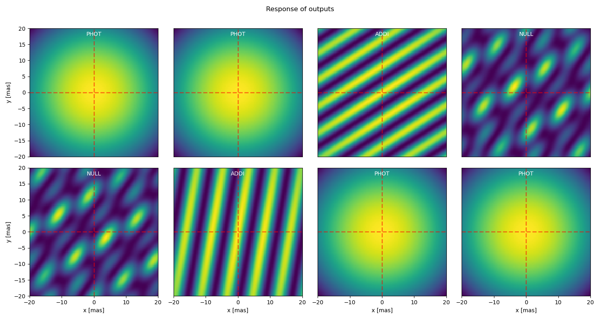

# nimodeler

**nimodeler** is an experimental Python package designed to simulate nulling interferometry data compatible with the NIFITS format.

It is built on top of the following libraries:
- **NIFITS**: https://github.com/rlaugier/nifits  
- **oimodeler**: https://github.com/oimodeler/oimodeler/

## Project Status

This package is currently at a very early stage of development.

## Current Features

At its current stage, **nimodeler** allows users to:

- Load a single NIFITS file
- Plot instrument responses for various channels:
  - Photometric  
  - Additive  
  - Nulling
- Extract data from these channels
- Extract the differential nulling channel, when available
- Compute simulated data using an **oimodeler** model with the same instrument response
- Perform data–model comparisons using a simple chi-squared method

